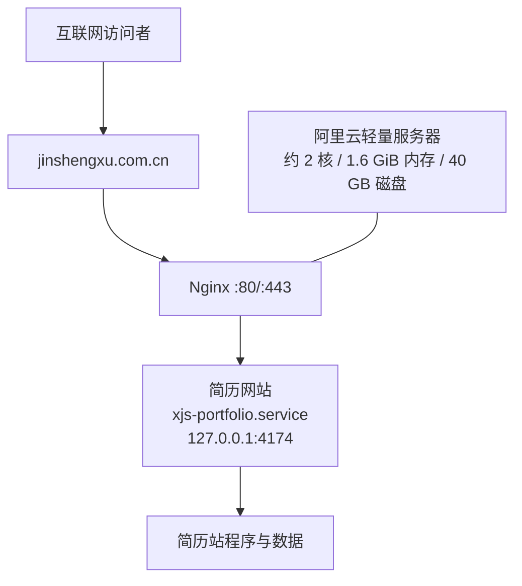

# 毕业进度小管家：项目学习与复现全指南

导航：[项目入口](README.md)｜[全维度复盘](项目全维度复盘与能力提升手册.md)｜[协作边界](AGENTS.md)｜[项目经历](毕业进度小管家_网站项目经历.md)

## 1. 文档目标与复现边界

本指南用于让新的开发者、面试官或运维人员理解项目为什么这样设计，并在不接触真实学生材料和生产密钥的前提下完成本地构建、测试、打包和服务器部署。

复现分为五个等级，必须分别记录：

| 等级 | 含义 | 本项目当前状态 |
|---|---|---|
| L1 | 阅读源码、配置和文档，确认实现存在 | 已完成 |
| L2 | 自动测试、静态检查和构建通过 | 已完成，38 项 Maven 测试与 8 项前端计算回归通过 |
| L3 | 本地 Tomcat 启动及接口可用 | 已完成；前台、后台和真实成绩 ZIP 接口返回 HTTP 200，DeepSeek 二次核对完成 |
| L4 | 真实桌面浏览器与手机视觉、触控验收 | 待用户执行 |
| L5 | 生产域名、HTTPS、上传、防攻击、回滚全链路 | 当前发布包尚未重新上传服务器；全部项目待按本指南验证 |

不要用 L1/L2 代替 L4/L5。毕业学分结果也不构成学校审核结论。

## 2. 先理解业务闭环

```text
学校/专业/年级
       ↓
选择已入库培养方案，或上传新方案
       ↓
上传个人成绩文件
       ↓
服务器本地解析并去除身份信息
       ↓
DeepSeek 强制二次核对 → 返回板块、课程、警告和核对意见
       ↓
用户人工核对并修正归属、学分、成绩、通过状态
       ↓
点击更新，浏览器统一重算要求/已计入/待补/百分比
       ↓
下载核验清单，最终交由学校审核
```

关键理念是“本地确定性解析 + DeepSeek 二次核对 + 人工确认”，而不是让 AI 直接决定学分或宣称自动解析永远正确。

## 3. 代码阅读顺序

1. `README.md`：功能、技术栈和边界。
2. `src/main/webapp/index.html`：单页结构。
3. `src/main/webapp/static/js/credit-audit.js`：文件上传、编辑、过期状态与显式重算。
4. `src/main/java/servlet/CreditAuditServlet.java`：请求校验、限流、任务池和超时。
5. `src/main/java/service/CreditAuditService.java`：PDF、Word、Excel、CSV、TXT 等解析及规模限制。
6. `src/main/java/service/ScoreArchiveParser.java`：成绩网页 ZIP 的展开限制。
7. `src/main/java/service/CreditPlanRegistryService.java`：培养方案结构化规则库。
8. `src/main/java/service/DeepSeekVerificationService.java`、`DeepSeekConfigService.java`：脱敏核对、模型与密钥配置。
9. `deploy/install-biyejindu.sh`：操作系统、Tomcat、Nginx、HTTPS 和内存隔离。
10. `deploy/update-biyejindu.sh`、`deploy/rollback-biyejindu.sh`：更新与恢复。
11. `docs/安全/生产安全与部署检查表.md`：上线核验清单。

## 4. 本地环境与构建

### 4.1 环境要求

- Java Development Kit 21（Java 开发工具包 21）。
- Maven 3.9 或更高版本。
- 需要本地运行时使用 Apache Tomcat 9；构建 WAR 不要求先启动 Tomcat。
- 运行 Maven 与前端单元测试不需要真实 DeepSeek API 密钥；完整接口回归需要单独配置有效密钥，密钥不得写入仓库、日志或测试样例。

### 4.2 构建与测试

在项目根目录执行：

```bash
mvn clean test
mvn clean package
node --test src/test/js/credit-audit-calculator.test.cjs
```

预期结果：

- Maven 测试共 38 项，0 失败、0 错误、0 跳过；前端计算回归共 8 项通过；
- 生成 `target/student_system.war`；
- 当前基线 WAR 大小为 40,286,114 字节，SHA-256 为 `6D3920CE85AF04BD1155315522B2BF2D55009450D95DCD77155F7F4BB1AC4BC2`；同一值记录在发布包的 `SHA256SUMS.txt`。

不同时间重新构建后摘要可能变化，应记录当次实际摘要，不能强行要求与基线一致。

PowerShell 计算摘要：

```powershell
Get-FileHash -Algorithm SHA256 .\target\student_system.war
```

Linux 计算摘要：

```bash
sha256sum student_system.war
```

## 5. 安全、内存与容量治理详解

### 5.1 为什么不能只限制“上传文件 8 MB”

8 MiB 的 ZIP 或 Office 文件在解压后可能远超 8 MiB；PDF 解析会产生文本与临时对象；Excel 可能包含极多行列；并发上传会把单次消耗乘以请求数。单一文件大小限制只能挡住明显的大文件，不能挡住 ZIP 炸弹、复杂文档、慢请求、并发堆积和日志无限增长。

因此项目按下面的顺序执行纵深防御：

```text
公网请求
  ↓ Nginx 请求体、频率、连接数和超时
Tomcat
  ↓ 请求总量、参数/分段数量、线程和连接数
Servlet
  ↓ 同源、字段白名单、单文件字节数、临时文件删除
解析队列
  ↓ 固定并发、有限排队、总时限、取消信号
文档解析器
  ↓ 文件签名、结构、压缩比、展开量、页数、行列和文本量
Java/systemd
  ↓ 堆、元空间、服务总内存、任务数、文件句柄和交换空间
持久化与日志
  ↓ 数据条目上限、保留期、原子写入和日志轮换
```

任何一层拒绝请求，后面的高成本处理都不会继续。

### 5.2 第一层：Nginx 公网入口

配置来源：`deploy/install-biyejindu.sh`。

| 控制项 | 当前值 | 目的 |
|---|---:|---|
| `client_max_body_size` | 18 MiB | 限制整个 HTTP 请求体，容纳两个各 8 MiB 文件及表单开销 |
| 上传频率 | 每 IP 每分钟 6 次，突发 4 次 | 阻止持续高频解析消耗 CPU/内存 |
| 普通 API 频率 | 每 IP 每分钟 30 次，突发 20 次 | 限制接口刷取 |
| 单 IP 并发连接 | 12 | 避免一个来源占满连接 |
| 请求体超时 | 60 秒 | 清理慢速上传 |
| 请求头超时 | 15 秒 | 减少慢速请求占用 |
| 上传解析代理读超时 | 120 秒 | 覆盖 110 秒任务上限及网络开销，不允许无限等待 |

为什么 Nginx 是 18 MiB，而 Servlet 请求上限是 17 MiB：外围略宽、应用层更精确，避免正常 multipart（多部分表单）开销被代理误伤，同时确保应用仍是最终判定者。

### 5.3 第二层：Tomcat 请求与线程边界

生产 Tomcat 只监听 `127.0.0.1:4180`，公网不能绕过 Nginx 直接访问。连接器限制如下：

| 项目 | 当前值 |
|---|---:|
| 最大工作线程 | 32 |
| 最小空闲线程 | 4 |
| 接收队列 | 20 |
| 最大连接数 | 64 |
| 最大 POST | 18,874,368 字节（18 MiB） |
| 最大参数数 | 40 |
| 最大 multipart 分段数 | 4 |
| 连接/保持连接超时 | 10 秒 |

Tomcat 的线程上限并不代表允许 32 个文档同时解析。高成本解析还会进入更小的专用队列，避免普通页面请求被解析任务拖死。

### 5.4 第三层：Servlet 上传校验与临时文件处理

`CreditAuditServlet` 使用：

- 单文件最大 8 MiB；
- 整个 multipart 请求最大 17 MiB；
- 只接受 `school`、`major`、`cohort`、`planHash`、`planId`、`planFile`、`scoreFile` 七个字段；
- 读取时只读取“上限 + 1”字节，不能只相信浏览器声明的文件大小；
- 无论成功或失败，都在 `finally` 中执行 `Part.delete()`，清理 Tomcat 临时上传部分；
- 文件名只取安全的提交名，错误消息去除换行并限制长度，避免日志/响应注入。

上传文件还会校验扩展名、文件头签名、ZIP 结构和可解析内容，不能通过把恶意文件改名为 `.pdf` 来绕过。

### 5.5 第四层：解析并发、排队和超时

高成本解析使用独立 `ThreadPoolExecutor`（线程池执行器）：

| 参数 | 值 | 行为 |
|---|---:|---|
| 核心/最大线程 | 2 / 2 | 最多两个文件任务并行解析 |
| 队列 | `ArrayBlockingQueue(12)` | 最多等待 12 个任务，内存不会无限增长 |
| 拒绝策略 | `AbortPolicy` | 队列满立即返回 HTTP 503 |
| 单任务时限 | 110 秒 | 超时取消任务并返回 HTTP 408 |

解析循环会检查线程中断标志。超时取消后，ZIP 逐块读取和主要解析循环能够尽快退出，而不是继续占用资源。DeepSeek 主请求最多等待 40 秒；仅瞬时网络失败或空响应会执行一次最长 55 秒恢复请求，鉴权失败、请求错误和限流不盲目重试，整体仍受 110 秒任务上限控制。

为什么是 2 个解析线程：服务器约 2 核、1.6 GiB 内存，还需要同时承载简历网站、Nginx 和操作系统。将解析并发做小，比追求瞬时吞吐更符合轻量服务器的稳定性目标。

### 5.6 第五层：压缩包与 Office 文件防爆炸

Apache POI 全局安全阈值：

- 最小解压比例 `0.02`；压缩后极小、展开后异常巨大的条目会被拒绝；
- 单个 Office 压缩条目最多 16 MiB；
- 可提取文本最多 2 MiB。

通用文档解析另有限制：

| 项目 | 上限 |
|---|---:|
| 压缩文档条目 | 1,000 |
| 单条目展开量 | 16 MiB |
| 累计展开量 | 64 MiB |
| 文本字符 | 1,000,000 |
| 表格行 | 10,000 |
| 每行单元格 | 60 |
| PDF 页数 | 300 |

成绩网页 ZIP 使用更严的边界：

| 项目 | 上限 |
|---|---:|
| 条目数 | 300 |
| 单条目 | 8 MiB |
| HTML 累计 | 16 MiB |
| 全部条目累计 | 32 MiB |

累计展开上限还会结合压缩文件大小计算比例上限，不能只依赖 ZIP 目录中可能不可信的 `size` 字段。读取过程中逐块累计，一旦超过边界立即抛出异常。

### 5.7 第六层：PDF 与大文档的内存策略

PDF 不直接要求整份解析过程都驻留 Java 堆：

1. 创建受系统临时目录管理的临时 PDF；
2. 使用 PDFBox 的 `createTempFileOnlyStreamCache()`，把随机访问缓存放到磁盘；
3. 限制 300 页和 1,000,000 个文本字符；
4. 使用 `try-with-resources` 关闭文档；
5. 在 `finally` 中删除临时 PDF。

这会把部分内存压力转为受控的临时磁盘压力。因此服务器必须同时监控 `$CATALINA_BASE/temp` 的体积和清理情况，不能只看 Java 堆。

### 5.8 第七层：Java 进程与操作系统硬边界

生产服务的 Java 参数：

```text
-Xms128m
-Xmx512m
-XX:MaxMetaspaceSize=192m
-XX:+UseG1GC
-XX:+ExitOnOutOfMemoryError
```

含义：初始堆 128 MiB、最大堆 512 MiB、元空间最大 192 MiB，使用 G1（垃圾优先）垃圾收集器；出现无法恢复的内存不足时退出，由 systemd 按失败策略重启，避免进程处于半失效状态。

systemd 再施加进程组边界：

| 项目 | 当前值 |
|---|---:|
| `MemoryMax` | 700 MiB |
| `MemorySwapMax` | 512 MiB |
| `TasksMax` | 96 |
| `LimitNOFILE` | 8,192 |

部署脚本仅在服务器没有 Swap（交换空间）时创建 2 GiB `/swapfile`，权限 `0600`，并设置 `vm.swappiness=10`。Swap 是内存尖峰的缓冲，不是扩容方案；若持续使用 Swap，必须降低并发、优化解析或升级内存，而不能靠增加 Swap 掩盖问题。

### 5.9 第八层：磁盘容量和持久数据增长

项目按“少存、限量、轮换、原子写”控制容量：

- 个人成绩原文件不入库、不进入公开目录；请求结束删除临时上传部分。
- 培养方案原文件不长期保存，只保存结构化板块、来源名和 SHA-256 摘要；规则库最多 5,000 条。
- 运营反馈最多 2,000 条；全局访客摘要最多 100,000 个、每日最多 20,000 个；日统计保留 90 天。
- 运营状态写入临时文件后原子替换，异常时删除临时文件，避免半写文件。
- Tomcat 访问日志保留 14 天；Nginx 与应用日志应接入系统轮换并定期检查。
- 发布包、旧 WAR 和备份不应无限堆积。上线后建议只保留“当前版本 + 最近两个可回滚版本”，删除前先核验当前版本和摘要。

建议上线后每周检查：

```bash
df -h
du -sh /var/lib/biyejindu /opt/biyejindu /var/log/nginx
du -sh /var/lib/biyejindu/tomcat/temp /var/lib/biyejindu/tomcat/logs
journalctl --disk-usage
```

若容量异常增长，先确定是上传临时文件、Tomcat 日志、Nginx 日志、发布备份还是运营数据，不要直接清空整个目录。

### 5.10 请求安全与权限边界

- 写请求要求同源、`Sec-Fetch-Site` 检查和 `X-Credit-Audit-Request` 自定义头，降低跨站请求伪造风险。
- 后台初始密码使用 32 字节随机值的十六进制形式（显示为 64 个字符），恒定时间比较，失败请求按 15 分钟窗口限速；后台修改后只保存单向哈希。
- 初始密码与 DeepSeek 设置加密密钥保存在 `/etc/biyejindu/biyejindu.env`，权限 `0640`；DeepSeek API 密钥可由环境变量提供或在后台加密保存，均不得写入仓库、日志或聊天。
- 服务使用无登录独立账号，`NoNewPrivileges`、`PrivateTmp`、`ProtectSystem=strict` 等 systemd 沙箱选项限制权限。
- 程序包只读，只有 `/var/lib/biyejindu` 可写。
- 浏览器侧设置 CSP（内容安全策略）、HSTS（HTTP 严格传输安全）、`nosniff`、禁止框架嵌入和权限策略。
- CSV 导出对 `= + - @` 等危险开头转义，避免表格公式注入。

## 6. 轻量服务器部署前后架构图

### 6.1 部署前



部署前的关键事实：公网入口由 Nginx 管理；简历网站已有独立 systemd 服务和 4174 端口；服务器没有足够余量同时长期运行两套新 Java 实例。

### 6.2 部署后

```mermaid
flowchart TB
    U[互联网访问者] --> D1[jinshengxu.com.cn]
    U --> D2[biyejindu.jinshengxu.com.cn]
    D1 --> N[Nginx :80/:443\n按域名路由]
    D2 --> N

    N -->|原配置保持不变| P[简历网站\nxjs-portfolio.service\n127.0.0.1:4174]
    N -->|请求体/频率/连接限制| B[毕业进度小管家\nbiyejindu.service\nTomcat 127.0.0.1:4180]

    P --> PD[/原简历程序与数据/]
    B --> BD[/var/lib/biyejindu\n结构化规则与运营状态]
    B --> TMP[PrivateTmp / Tomcat temp\n请求后清理]

    OS[systemd 与 Linux 资源边界] --> P
    OS --> B
    OS --> MEM[Java 堆 512 MiB\n服务总内存 700 MiB\nSwap 上限 512 MiB]
    SWAP[2 GiB 系统 Swap\n仅作尖峰缓冲] --- OS
```

部署后的隔离不是 Docker 容器隔离，而是账号、进程、端口、目录、配置、权限和资源配额的组合隔离。当前服务器内存很小，引入 Docker 不能自动解决资源竞争，反而增加运维层次；因此本项目选择 systemd + 独立 Tomcat Base，方案更轻、更透明。

## 7. 两个网站运行与更新的矛盾如何处理

### 7.1 矛盾本质

同一台机器上的两个网站共享 CPU、内存、磁盘、网络和 Nginx。更新新站时如果重启全局服务、覆盖公共目录、修改同一端口、启动第二套大内存实例或写错 Nginx 配置，就可能让原简历网站一起中断。

### 7.2 隔离矩阵

| 资源 | 简历网站 | 毕业进度小管家 | 冲突处理 |
|---|---|---|---|
| systemd 服务 | `xjs-portfolio.service` | `biyejindu.service` | 更新只操作后者 |
| 本机端口 | `127.0.0.1:4174` | `127.0.0.1:4180` | 无端口复用 |
| 程序目录 | 原简历目录 | `/opt/biyejindu` | 不覆盖彼此文件 |
| 数据目录 | 原简历数据 | `/var/lib/biyejindu` | 权限与备份独立 |
| Nginx | 原域名配置 | `/etc/nginx/conf.d/biyejindu.conf` | 按域名分流 |
| 运行时 | Node.js/原环境 | Java 21 + 独立 Tomcat Base | 不升级简历站运行时 |
| 更新动作 | 不重启 | 备份、原子换包、重启自身 | 故障域限制在新站 |

### 7.3 首次安装的保护顺序

1. 先检查 `xjs-portfolio.service` 和 4174 端口健康；不健康则停止部署，避免把既有故障误判为新站引起。
2. 安装 Java/Tomcat 到新站独立目录，不修改 Node.js。
3. 创建 `biyejindu` 无登录账号和专属数据目录。
4. 先在 `127.0.0.1:4180` 启动并用本机 `curl` 健康检查。
5. 只有应用健康后才增加新子域名 Nginx 配置和 HTTPS。
6. 再检查 4174 与 4180，确认两个站点都在线。

### 7.4 后续更新的保护顺序

```text
检查简历服务与 4174
        ↓
核验新 WAR 存在，备份旧 WAR
        ↓
同文件系统原子替换新站 WAR
        ↓
只重启 biyejindu.service
        ↓
检查 4180 健康
   ┌────┴────┐
 成功       失败
  ↓          ↓
再查4174   恢复旧 WAR
             ↓
        重启新站并再查健康
             ↓
        确认简历站未受影响
```

更新脚本不执行 Nginx reload、不申请证书、不安装运行时，缩小每次变更面。

### 7.5 为什么不做双实例蓝绿更新

蓝绿部署通常能让新站无中断切换，但需要同时运行旧、新两个 Java 实例。以每个实例最大 700 MiB 计算，再加操作系统、Nginx、简历站和文件解析峰值，1.6 GiB 内存没有安全余量。这里选择让毕业进度站短暂重启、保证简历站持续在线，是基于资源事实的风险取舍，不是技术能力缺失。

### 7.6 从招聘方视角如何评价这个方案

招聘方通常不只看“用了哪些框架”，更关心候选人是否：

- 先盘点现有业务和服务器事实，再做部署决策；
- 能说明为什么不用更流行但不适合当前资源的方案；
- 能把故障域限制在新系统，而不是让一次更新拖垮所有站点；
- 有备份、健康检查、自动恢复和验证清单；
- 如实承认“新站短暂不可用”这一代价，并知道何时应升级为蓝绿部署或容器编排。

当服务器升级到至少 4 GiB 内存且业务要求零停机时，可再评估双实例蓝绿发布；在当前服务器上不应为了简历中的技术名词牺牲稳定性。

## 8. 生产部署复现

### 8.1 域名

为 `jinshengxu.com.cn` 添加：

| 项目 | 值 |
|---|---|
| 类型 | A |
| 主机记录 | `biyejindu` |
| 记录值 | 当前轻量服务器公网 IPv4 |

不要修改简历网站现有的 `@`、`www` 等记录。

### 8.2 首次安装

将发布 ZIP 上传到服务器后：

```bash
cd /home/admin/upload
sha256sum biyejindu-deploy-20261006-1830.zip
unzip biyejindu-deploy-20261006-1830.zip -d biyejindu-deploy
cd biyejindu-deploy
sudo bash install-biyejindu.sh
```

ZIP 摘要每次原位重建后都会变化。本次交付文件大小为 40,265,370 字节，SHA-256 为 `5F84FCB04B51F9855C1A4A012AFCB09F566FC146F75D3F65A03028F02352D034`。上传后在服务器再次计算并逐字符比对；不得继续使用旧版固定摘要。

安装成功后立即把终端输出的后台初始密码存入密码管理器，不要粘贴到聊天或提交仓库。随后登录后台配置 DeepSeek API 密钥、模型与推理档位，先测试连接，再使用脱敏样例完成一次强制二次核对。

### 8.3 首次真实部署故障复现与排查顺序

首次生产部署已真实遇到并解决以下问题。复现时不要把这些问题当作偶发现象，而应把它们当成固定检查项。

#### 故障 A：systemd `203/EXEC` / `Permission denied`

现象：`biyejindu.service` 不断自动重启，日志显示 `Failed to execute .../catalina.sh: Permission denied`。

原因：服务使用 `User=biyejindu`，但 Tomcat `bin` 目录和 `catalina.sh` 属于 `root:root` 且为 `0750`，运行用户没有遍历/执行权限。

排查：

```bash
systemctl cat biyejindu.service
namei -l /opt/biyejindu/tomcat/bin/catalina.sh
ls -ld /opt/biyejindu/tomcat/bin
ls -l /opt/biyejindu/tomcat/bin/catalina.sh
journalctl -u biyejindu.service -n 50 --no-pager
```

修复原则：保持 root 为所有者，把 Tomcat runtime 组设为 `biyejindu`，目录给组 `r-x`，脚本给组执行权限；不要使用 `chmod 777`。

#### 故障 B：Tomcat 无法创建 `conf/Catalina/localhost`

现象：服务已经运行、4180 已监听，但日志出现 `Unable to create directory for deployment`。

原因：Tomcat Base 的配置目录按最小权限设置为 `root:biyejindu 0750`，而 Tomcat 启动过程中仍需要创建特定子目录。

修复原则：只为实际需要的 `conf/Catalina/localhost` 创建可写目录，不扩大整个 `conf` 的写权限。

#### 故障 C：`logs/ondog-data.log` 写到 `/logs` 失败

现象：Logback 报 `Failed to create parent directories for [/logs/ondog-data.log]`。

原因：应用日志使用相对路径 `logs/...`，systemd 默认工作目录不是 Tomcat Base。

修复：在 service 中增加：

```ini
WorkingDirectory=/var/lib/biyejindu/tomcat
```

然后 `daemon-reload` 并重启服务，确认日志文件实际生成在 `/var/lib/biyejindu/tomcat/logs/`。

#### 故障 D：`No shutdown port configured`

现象：停止服务时出现 `No shutdown port configured`。

原因：`server.xml` 使用 `<Server port="-1">` 禁用 shutdown port，但 `ExecStop` 仍调用 `catalina.sh stop`。

修复原则：保持 shutdown port 禁用，删除该 `ExecStop`，让 systemd 通过 OS 信号停止 Java 主进程。

#### 故障 E：HTTPS 证书已签发，但 `nginx -t` 因 Let’s Encrypt include 文件不存在失败

现象：Certbot 能成功签发 `biyejindu.jinshengxu.com.cn` 证书，但 Nginx 配置引用 `/etc/letsencrypt/options-ssl-nginx.conf` 时提示文件不存在。

原因：部署脚本把某些 Certbot 安装方式才会生成的辅助文件当成了必然存在的环境事实。

修复原则：先检查文件是否存在；不存在时使用最小 TLS 配置：证书、私钥、`TLSv1.2 TLSv1.3`，再执行 `nginx -t`。

#### 故障 F：超长 here-doc 粘贴发生终端串行错乱

现象：一次性粘贴长 Nginx 配置时，终端中出现多段命令拼接，导致实际执行内容难以确认。

处理：把生产变更拆成小步骤：写配置文件 → `nginx -t` → reload → 本机 Host/`--resolve` 测试 → 公网测试。任何一步失败就停，不继续执行后续动作。

#### 推荐排障顺序

```text
systemd 是否 active
  ↓
运行用户能否遍历并执行 Tomcat
  ↓
4180 是否 LISTEN
  ↓
本机首页/API 是否 200
  ↓
Tomcat 是否有可写目录与日志
  ↓
DNS 是否指向当前公网 IP
  ↓
Nginx -t 是否通过
  ↓
本机 Host/--resolve 是否正确命中子域名
  ↓
证书 SAN 是否匹配
  ↓
公网 HTTP 301 / HTTPS 200
  ↓
最后重新检查原简历站 4174 与公网 200
```

### 8.4 部署后验证

```bash
systemctl status biyejindu --no-pager
systemctl status xjs-portfolio --no-pager
ss -lntp | grep -E '4174|4180|:80|:443'
curl -I https://biyejindu.jinshengxu.com.cn/
curl -I https://jinshengxu.com.cn/
free -h
swapon --show
systemctl show biyejindu -p MemoryCurrent -p MemoryPeak -p MemoryMax
```

还要用脱敏测试文件验证：正常 PDF/Excel、超过 8 MiB、扩展名伪装、ZIP 条目超限、高压缩比 ZIP、重复高频请求。再验证后台密码变更、DeepSeek 密钥不回显、模型同步/添加、连接测试、首次解析与超时恢复。不能用真实学生成绩做攻击测试。

### 8.5 后续更新与回滚

```bash
sudo bash update-biyejindu.sh
```

健康检查失败时脚本自动恢复旧 WAR。需要主动撤销新站入口时：

```bash
sudo bash rollback-biyejindu.sh
```

回滚只处理新站，不删除业务数据、证书或 Swap，也不修改简历网站。

## 9. 手机端复现与验收

源码在 680 像素以下切换单列，但必须在真实设备上逐项检查：

1. 首页人物是否完整、有张力且不遮挡标题与主按钮。
2. 页面滚动后背景是否持续可见，内容是否仍然透明可读。
3. 文件选择、下拉框、复选框和主要按钮是否易于触控。
4. 长课程名、错误信息和 47 门以上课程是否换行而不横向溢出。
5. 按“首次生成；修改板块或学分；点击更新；核对所有汇总；再次修改；再次点击更新；再次核对所有汇总”的顺序，确认两轮都不复用旧数据。
6. 微信内置浏览器、手机 Chrome/Edge/Safari 至少覆盖用户实际使用的一种。
7. 弱网、上传中断、超限和解析超时时是否给出可理解提示。

通过标准不是“能打开”，而是能完成上传、核对、修改、重算和下载的完整流程。

## 10. 常见故障定位

| 现象 | 优先检查 | 处理原则 |
|---|---|---|
| HTTP 413 | Nginx 18 MiB、Tomcat 18 MiB、Servlet 17 MiB/单文件 8 MiB、Tomcat `maxPartCount=8` | 不要只放大一层；前台解析请求需容纳 7 个 multipart 部分，大小与部分数必须分别核对 |
| HTTP 408 | 110 秒解析时限、PDF 页数、ZIP 结构 | 使用脱敏样例复现，不能无限提高超时 |
| HTTP 429 | 应用和 Nginx 限流 | 确认是否真实误伤，再调整窗口并补测试 |
| HTTP 503 | 2 线程 + 12 队列已满 | 先看并发与内存，轻量机不要盲目扩线程 |
| DeepSeek 未返回结果 | 后台密钥、模型、官方接口响应、主请求与恢复请求日志 | 先测试连接；瞬时超时允许一次恢复，鉴权失败、请求错误和限流应直接提示，不得无限重试 |
| 文件格式错误 | 扩展名、签名、内部结构 | 让用户导出标准格式，不放松签名检查 |
| 内存上升 | 解析并发、PDF 临时缓存、Java 堆、Swap | 对照单次请求和峰值；持续 Swap 表示容量不足 |
| 磁盘上升 | temp、Tomcat/Nginx 日志、备份、运营数据 | 定位目录后按保留策略清理，不整目录删除 |
| 新站更新失败 | `biyejindu` 日志、4180 健康、旧 WAR | 使用自动回滚；不要重启简历服务 |
| systemd `203/EXEC` | `User/Group`、`namei -l`、Tomcat `bin` 权限 | 让运行用户具备路径遍历和脚本执行权限，不用 `777` |
| `Unable to create directory for deployment` | `$CATALINA_BASE/conf/Catalina/localhost` | 只创建必要可写子目录，不放宽整个配置树 |
| 应用日志写到 `/logs` 失败 | service 的 `WorkingDirectory`、Logback 相对路径 | 固定工作目录到 Tomcat Base |
| `No shutdown port configured` | `server.xml` 的 `port=-1` 与 `ExecStop` | 保持 shutdown port 禁用，交由 systemd OS 信号停止 |
| HTTPS 证书已签发但 `nginx -t` 失败 | 引用的 Let’s Encrypt include 文件是否真实存在 | 不假定辅助文件存在；使用最小 TLS 配置并先 `nginx -t` |
| 长 here-doc 粘贴错乱 | 终端实际文件内容、`nginx -T` | 生产修改拆成小步，每步验证后再继续 |
| 简历站异常 | 先查更新前基线、4174 和原服务日志 | 立即停止扩展操作，确认是否与新站无关 |

## 11. 安全阈值调整规则

任何人若要增大文件、线程、队列、超时或内存上限，必须先回答：

1. 哪个真实且脱敏的样例触发了当前限制？
2. 单请求最坏展开量和峰值内存是多少？
3. 两个并发解析时，简历网站还有多少安全余量？
4. 磁盘临时文件和日志的增长上限是多少？
5. 是否补充了正常、边界、超限和并发回归测试？
6. 生产监控和回滚路径是否仍然成立？

没有测量和回归证据，不得仅为“兼容更多文件”放宽限制。

## 12. 分阶段学习计划

| 阶段 | 学习目标 | 实践动作 | 通过标准 |
|---|---|---|---|
| 跑通 | 理解构建与测试入口 | 执行测试、打包并核对产物 | 38 项 Maven 测试和 8 项前端测试通过，能解释 WAR 用途 |
| 理解 | 掌握输入到结果的数据流 | 跟踪一个脱敏 Excel/PDF 样例 | 能指出每步输入、输出和人工确认点 |
| 拆解 | 理解安全与容量上界 | 为每层限制找到代码或脚本位置 | 能解释为何只限制 8 MiB 不够 |
| 运维 | 理解双站隔离和更新 | 在测试环境演练安装、失败更新与回滚 | 4174 不受影响，4180 可恢复 |
| 改进 | 用测量校准设计 | 记录并发解析的内存、Swap、磁盘与耗时 | 根据数据提出保留或调整阈值的理由 |

最核心的三组知识是：不可信文件解析与 ZIP 安全、Java/操作系统资源预算、单机多服务隔离与可回滚发布。

## 13. 数据、产物与清理边界

- 本地复现只使用自行构造或脱敏的样例；真实成绩和培养方案原件不得提交仓库。
- `target/` 可由 Maven 重建；当前部署完成前保留已校验 WAR 作为证据。
- `release/` 中的 ZIP 用于服务器上传，不是源码仓库的一部分。
- `logs/`、浏览器截图、临时文件和服务器备份按验收/回滚需要保留，不确定时不删除。
- 正式文档与部署脚本必须保留；历史说明若被替代，应在旧文档中指向本指南，而不是制造多个“最终版”。

## 14. 复现完成检查表

- [ ] 38 项 Maven 测试与 8 项前端计算回归通过。
- [ ] WAR 构建成功并记录当次 SHA-256。
- [ ] 未把真实密钥、真实成绩、日志或构建包加入 Git。
- [ ] 正常与恶意脱敏样例均得到预期结果。
- [ ] 服务器只开放必要公网端口，4180 仅监听本机。
- [ ] `biyejindu` 与 `xjs-portfolio` 两个服务独立、同时健康。
- [ ] Java 堆、服务总内存、Swap、临时目录和日志增长已观察。
- [ ] HTTPS 与证书自动续期已验证。
- [ ] DeepSeek 密钥不回显、模型/档位配置、连接测试和强制二次核对已验证。
- [ ] 更新失败能够恢复旧 WAR，简历网站未重启。
- [ ] 真实手机完成上传、编辑、重算和结果验收。
